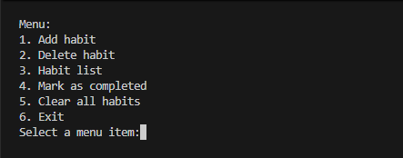
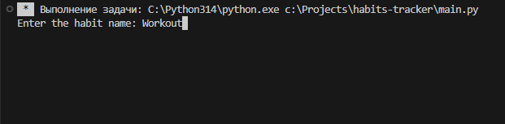
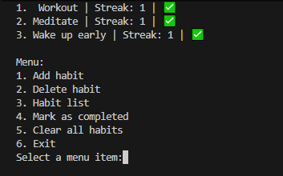

# 📈 Habit Tracker (SQLite Version)

A console-based Python project for tracking daily habits with SQLite database storage and multi-language support.

⸻

📌 Description

This project allows you to create habits, track daily completion, and maintain streaks. All data is stored locally in an SQLite database, ensuring reliable data persistence, relational logging, and automatic history cleanup.

⸻

⚙️ Features
• **Add and delete habits** (with automatic cascade deletion of related logs)
• **Mark habits as completed** (with protection against duplicate checks on the same day)
• **Automatic streak calculation** based on daily completions
• **Multi-language support** (Russian and English available at startup)
• **SQLite database storage** utilizing relational tables
• **Robust error handling** (input validation, out-of-bounds index protection)
• **Clear database tool** to reset your tracker easily

⸻

🧠 How It Works
• Data is stored in a local `database.db` file using two connected tables: `habits` and `habit_logs`.
• When a habit is marked as completed:
  • The system queries the logs to see if it has already been done today.
  • If it's a new completion for the day, a log entry is created, and the streak increments.
• Deleting a habit automatically purges its entire completion log due to `ON DELETE CASCADE` constraints.

⸻

🛠 Tech Stack
• Python 3
• SQLite (`sqlite3`)

⸻

📊 Database Schema

### `habits` Table
| Column | Type | Description |
| :--- | :--- | :--- |
| **id** | INTEGER PRIMARY KEY AUTOINCREMENT | Unique identifier for each habit |
| **name** | TEXT | The name of your habit |
| **streak** | INTEGER | Current consecutive completion count |

### `habit_logs` Table
| Column | Type | Description |
| :--- | :--- | :--- |
| **habit_id** | INTEGER | Foreign key referencing `habits(id)` |
| **log_date** | TEXT | Date string formatted as `YYYY-MM-DD` |

⸻

🖼 Screenshots





 ⸻

▶️ How to Run

1. Clone the repository:
   ```bash
   git clone [https://github.com/d3arkw/habit-tracker](https://github.com/d3arkw/habit-tracker)
   cd habit-tracker
2. Run the application:
    python main.py
  
  ⸻

📁 Project Structure
  habit-tracker/
  │── main.py          # Main application code and CLI loop
  │── .gitignore       # Standard git configuration (ignores *.db files)
  └── database.db      # SQLite database file (auto-generated on first run)
  
  ⸻
 🚀 Future Improvements

-- Dynamic streak reset tracking if a day is skipped
-- Transition from CLI a web interface or modern GUI
-- Advanced data visualization
